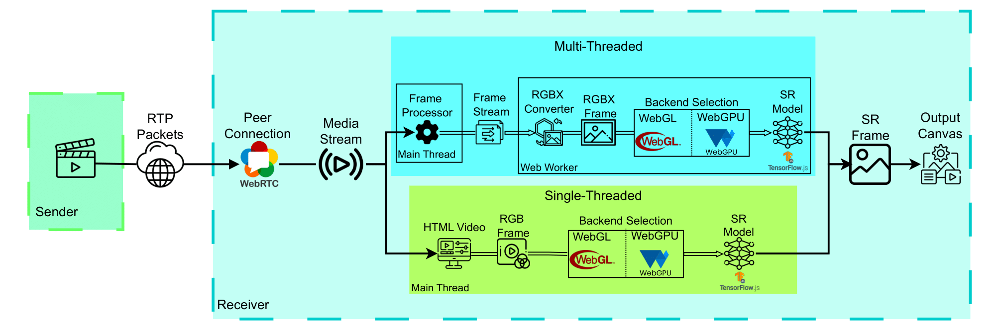

# VSR-Bench: An Open-Source Platform for Browser-Native Real-Time VSR Evaluation in WebRTC

**Authors:** Matin Fazel, Abdelhak Bentaleb  
**Paper:** *VSR-Bench: An Open-Source Platform for Browser-Native Real-Time VSR Evaluation in WebRTC*

<!-- [](LICENSE)
[](link-to-paper-if-available) -->

## Introduction

This repository provides an open-source platform for the paper "VSR-Bench: An Open-Source Platform for Browser-Native Real-Time VSR Evaluation in WebRTC". The platform consists of **Sender** and **Receiver** components, enabling evaluation of video super-resolution models within a WebRTC-based pipeline. It supports experimentation and can be easily adapted for various RTC and video streaming research purposes.

## Overview

This figure provides an overview of the proposed real-time video super-resolution platform, illustrating the complete end-to-end pipeline.



## Demo

<video src="docs/demo.mp4" controls playsinline style="max-width: 75%; height: auto;"></video>


## Features

- 🎥 Real-time video super-resolution at the receiver side over WebRTC
- 🚀 Configurable video encoding parameters (H264/VP8)
- 🖥️ Integration of WebGL and WebGPU graphics backends
- 🏗️ Support for multiple super-resolution model architectures
- 🔧 Modular sender-receiver architecture

## Installation and Setup

### Prerequisites

- Python 3.12+
- Linux environment (recommended)
- GPU: NVIDIA RTX-class GPU (e.g., RTX 3060 or higher) or equivalent 
- **Modern browser** with both [WebGL](https://get.webgl.org/) and [WebGPU](https://web.dev/webgpu/) **enabled** (e.g., latest Chrome, Edge, or Chromium-based browsers)

> **Note**: A dedicated GPU is essential for real-time performance. CPU-only execution will result in significantly degraded performance and may not achieve real-time processing rates.

### Clone Repository

```bash
git clone https://github.com/anonymous/VSR-Bench-project.git
cd VSR-Bench-project
```

## Python Environment (Sender + Telemetry)

Use a single Python environment for both the sender and telemetry server.

### 1. Create Virtual Environment

```bash
python3 -m venv VSR-Bench
```

### 2. Activate Virtual Environment
```bash
source VSR-Bench/bin/activate
```

### 3. Install Dependencies

```bash
pip install -r requirements.txt
```

## Sender Setup
This sender implementation uses [aiortc](https://github.com/aiortc/aiortc) version 1.9.0 as the main library for the video server.


### 1. Codec Configuration (VP8):
Edit `VSR-Bench/lib64/python3.12/site-packages/aiortc/codecs/vp8.py`:

To eliminate encoder-induced quality variability during evaluation, fix the VP8 quantizer by setting:

```python
self.cfg.rc_min_quantizer = 0   # ~ line 271
self.cfg.rc_max_quantizer = 0  # ~ line 272
```
### 2. Run Sender

```bash
# Activate virtual environment
source VSR-Bench/bin/activate

# Run the video server
cd Server/
python server_video.py
```

#### Network Emulation (Optional)

For experiencing real-world bandwidth fluctuations during testing, we utilize [Ahaggar](https://github.com/NUStreaming/Ahaggar) network emulator.

## Telemetry Server

The telemetry server stores end-to-end latency and network statistics reported by the client-side browser, along with receiver-side hardware utilization and the upsampled frames.

```bash
# Activate virtual environment
source VSR-Bench/bin/activate

# Run the telemetry server
cd Telemetry/
python main.py
```


## Client Setup

### 1. Browser Configuration

For Chrome-based browsers, WebGPU support requires enabling experimental flags:

1. Enable WebGPU flag: Navigate to `chrome://flags/#enable-unsafe-webgpu` and set to "Enabled"
2. For Linux users: Ensure [Vulkan](https://github.com/KhronosGroup/Vulkan-Docs) is installed on your system.


### 2. Run Client

```bash
# Navigate to client directory
cd Client/

# Start a local server (Terminal 1)
python3 -m http.server 8000 --bind 127.0.0.1
```

Then launch the client in Google Chrome using the provided script:

```bash
# Launch the client (Terminal 2)
./Launch.sh http://localhost:8000
```

## Credits and Acknowledgments

This project builds upon and is inspired by several excellent open-source efforts in the WebRTC, real-time streaming, and browser-based media processing communities. We gratefully acknowledge the following projects, from which ideas, design patterns, and in some cases code snippets were adapted:

- [aiortc](https://github.com/aiortc/aiortc) — Python WebRTC implementation that forms the foundation of the sender-side pipeline
- [TensorFlow.js GPU Pipeline Example](https://github.com/tensorflow/tfjs-examples/tree/master/gpu-pipeline) — Source of WebGL/WebGPU shader-based GPU rendering utilities used in the browser pipeline.
- [Processing video streams on the Web (W3C Geek Week 2022)](
https://github.com/tidoust/media-tests) — Experimental codebase exploring browser-native video processing pipelines using WebCodecs, WebRTC insertable streams, WebGPU, and timing instrumentation. Portions of the client-side processing and measurement approach were informed by this repository

<!-- ## Citation

If you use this benchmark platform in your research, please cite our paper:

```bibtex
@article{your_paper_2024,
  title={VSR-Bench: An Open-Source Platform for Browser-Native Real-Time VSR Evaluation in WebRTC},
  author={Your Name},
  journal={Your Journal/Conference},
  year={2024}
}
```

## License

[Add your license information here]

## Contact

[Add your contact information here] -->
